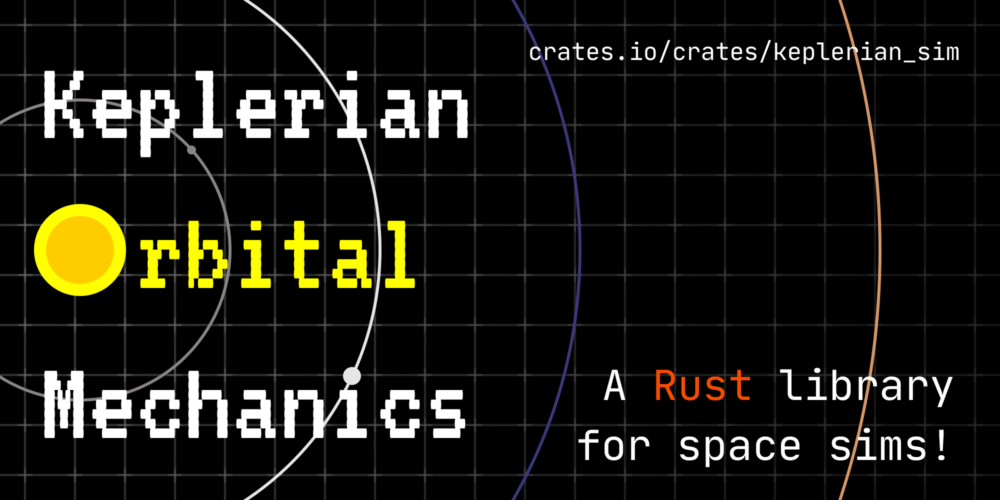

<h1>
    
</h1>

A Rust library for simulating Keplerian orbits.

[Check out the demo!](https://not-a-normal-robot.github.io/keplerian-sim-demo/)

- [Documentation](https://docs.rs/keplerian-sim/)
- [Crate](https://crates.io/crates/keplerian-sim)

## External Dependencies
You'll need Cargo and Rust to run the example binary. You can get it [at rustup.rs](https://rustup.rs/).  
You'll also need `rustfmt` to build the code, which you can install with `rustup component add rustfmt`.  
You should not need to install `rustfmt` if you are a user of this library and only want to use it in your own project, as `rustfmt` is only used in `build.rs`, which is not included in the distributed crate in crates.io.

## Feature flags
The crate has the following feature flags:
- `serde`: Derives `Serialize` and `Deserialize` on public structs. Disabled by default.
- `mint`: Enables interoperability across math libraries using the `mint` crate. Disabled by default. Note that this only applies to the `Matrix3x2` struct.
- `std`: Use `std` for math float operations.
- `libm`: Use `libm` for math float operations. Useful for `no_std` environments. Will not override the `std` feature flag.
- `mint-serde`: `mint` and `serde` feature flags, and enables the `serde` feature flag on `mint`.
- `fast-math`: Enables `libm`'s `fast-math` feature flag.

## Minimum Supported Rust Version (MSRV)
<!-- When changing the MSRV, don't forget to change `Cargo.toml`! -->
The current MSRV is **`1.81.0`**.  
MSRV changes is out-of-scope for this crate's SemVer guarantees and may change in minor or major releases.  
If this version number and the one in Cargo.toml do not match, then assume the one in Cargo.toml is the correct one, and create an issue regarding the mismatch.

## Running
This project is a library crate, so you can't really 'run' that, but you can run the example binaries.  
1. Clone the repo: `git clone https://github.com/Not-A-Normal-Robot/keplerian-sim`
2. Check out the available example binaries: `cargo run --example`
3. See the list of example binaries: `cargo run --example`
3. Run an example binary: `cargo run --example <binary_name>`

For the examples that dump a CSV, you can use external tools to chart it.  
One example is https://csvplot.com/.

There's also a demo crate showcasing this library in action:
- Deployment: https://not-a-normal-robot.github.io/keplerian-sim-demo/
- Source code: https://github.com/Not-A-Normal-Robot/keplerian-sim-demo/

## Benchmarking
You can run `cargo bench` to run the benchmarks in `/benches`.

## Testing
You can run `cargo test` to run the tests.

## Resources
I did not come up with the algorithms myself. For more information and useful resources to learn about the algorithms used, check out the `CREDITS.md` file.